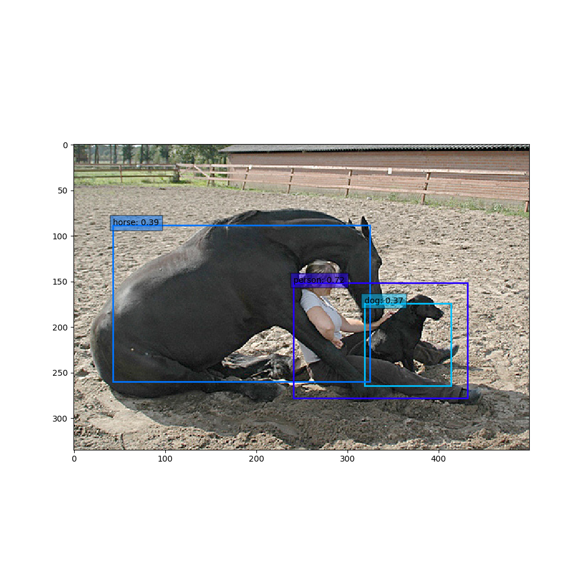
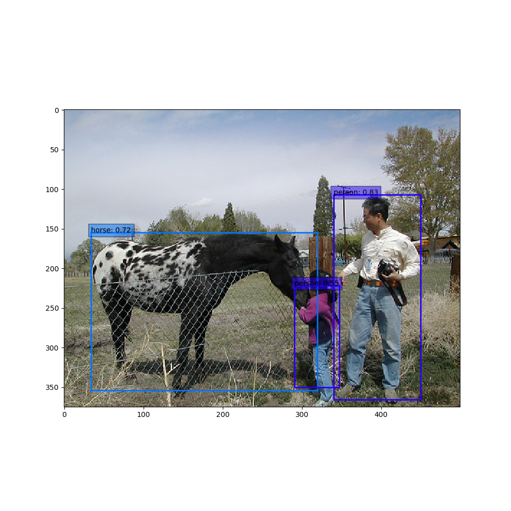
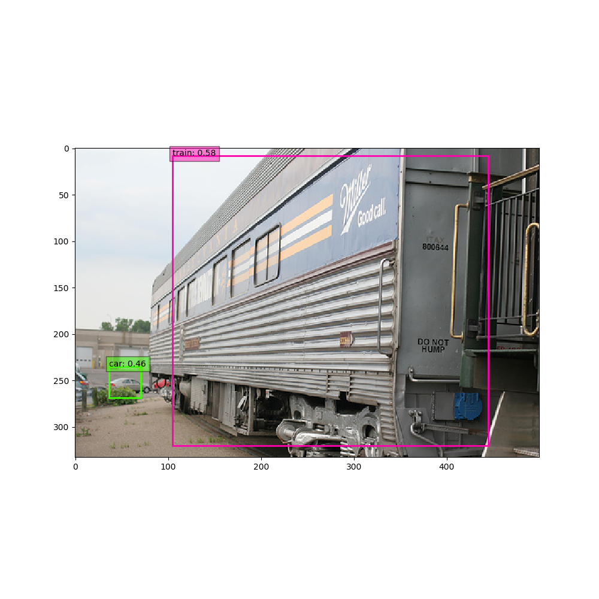
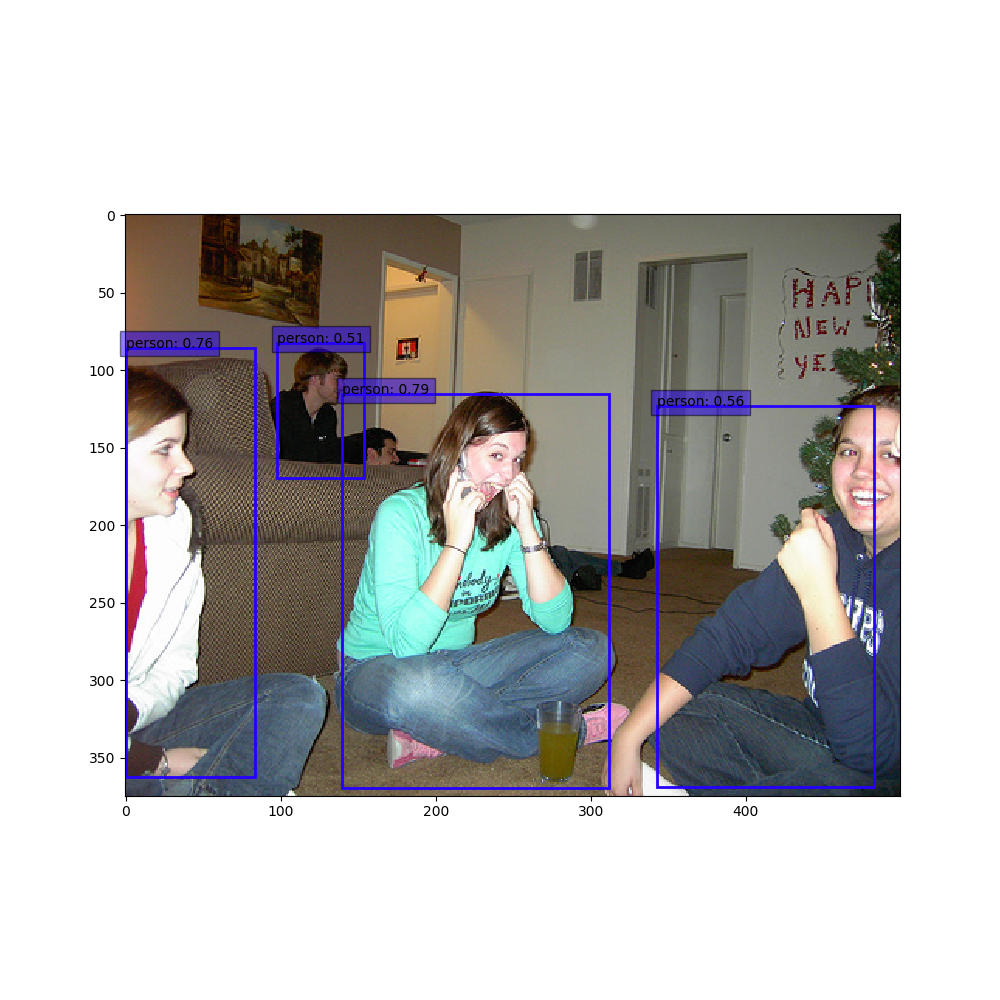
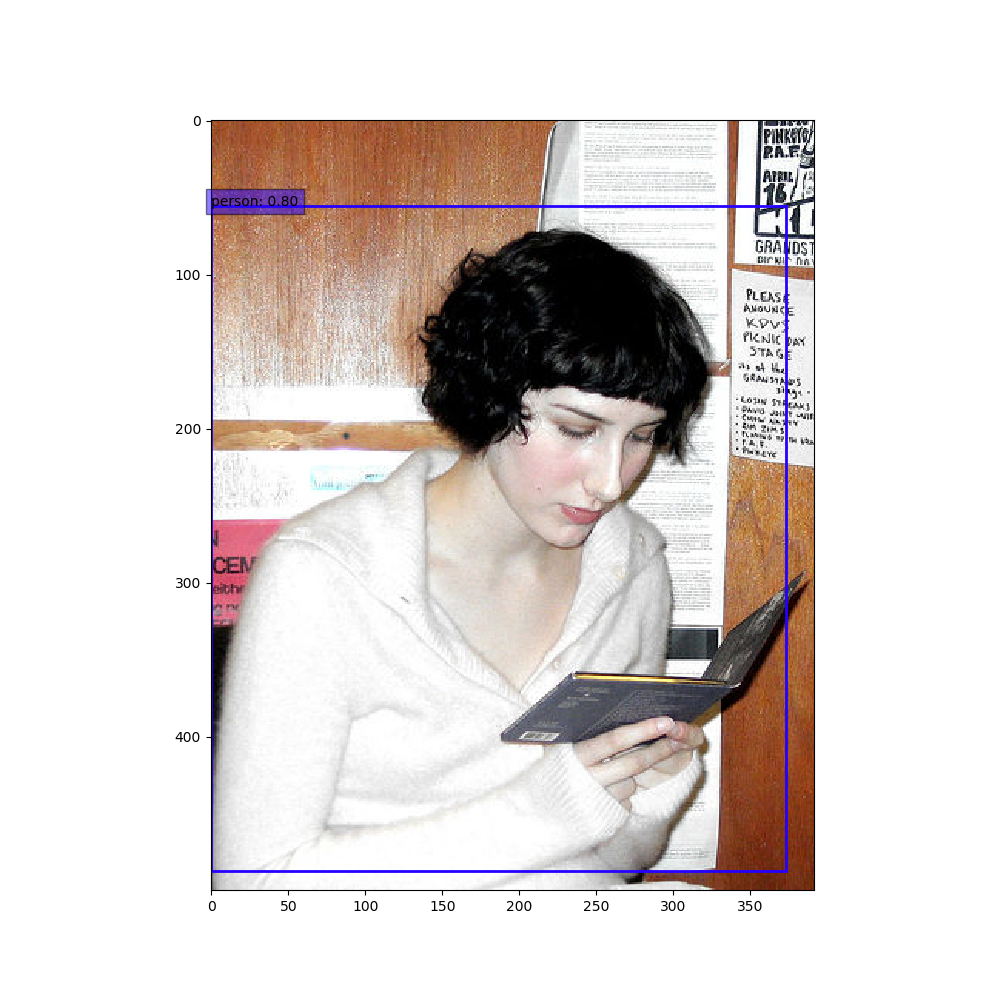
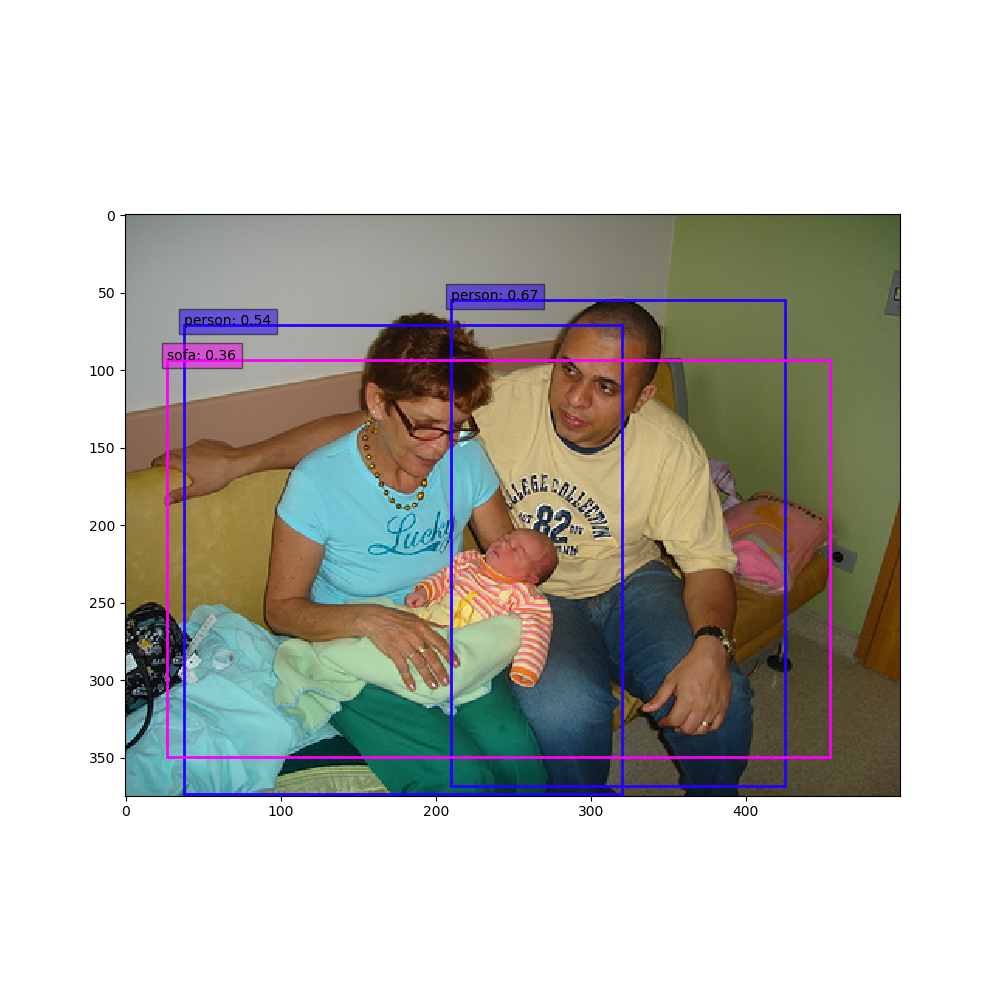
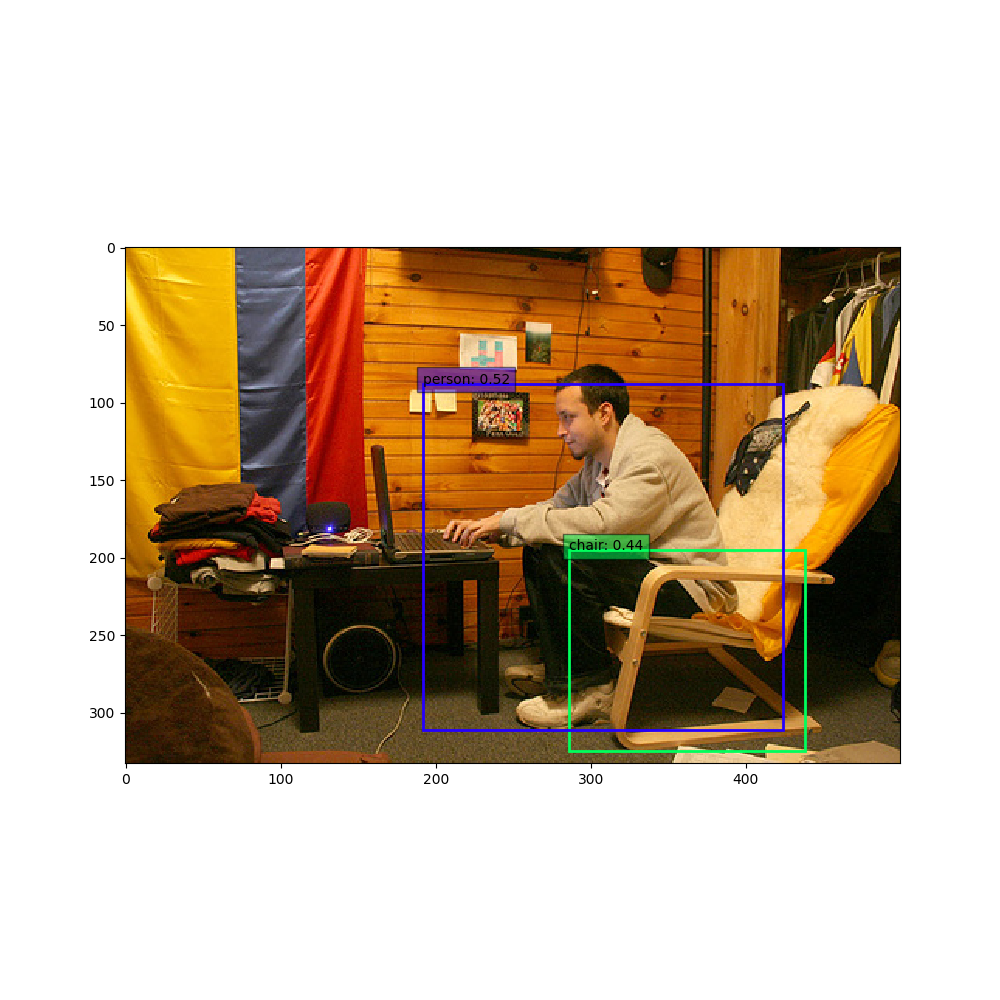

# YOLOv1-Pytorch implement


## Detials

You can see more details about Yolo by clicking the link below:

<https://zhuanlan.zhihu.com/p/64051698>


## Pretrained Model

You can download pretrained ResNet-Backbone YOLOv1 weight here: 

https://pan.baidu.com/s/1YnPqOepzAbr9T_z4Ux-Ocg


## Demo

















## Features

* auto-save and load  mechanism, default dir is './model'
* base-net can be chose from pre-trained ResNet18、ResNet50 and ResNet101


## Setup

the data set dir should be like this: 

````
base_dir
   VOC2007
   	Annotations
   	ImageSets
   	JPEGImages
   	SegmentationClass
   	SegmentationObject
   VOC2012
   	Annotations
   	ImageSets
   	JPEGImages
   	SegmentationClass
   	SegmentationObject
````

you can setup the base_dir by this:

```
python train.py --voc_data_set_root /base_dir
```


## usage

* you can train model by this：

* ```
  python train.py --voc_data_set_root /media/charles/750GB/VOC0712trainval --num_workers 12 --batch_size 16 --backbone resnet50 --save_step 500
  ```

* assign the dir of pic in predict.py and run to see the demo

* model weights will be uploaded afterwards


